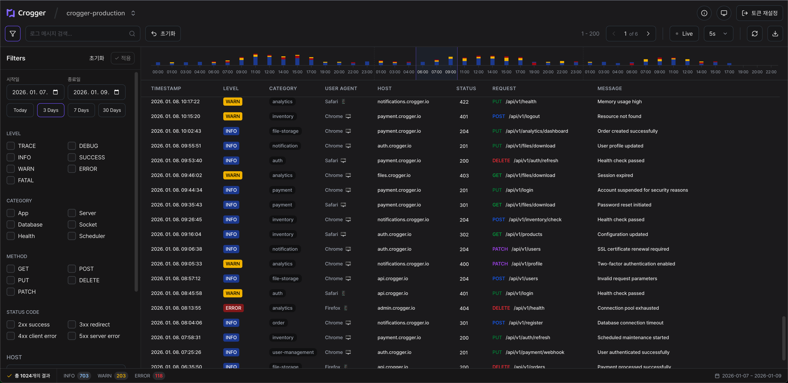

<div align="center">


[](https://github.com/team-croni/crogger/releases/latest)
[](./LICENSE)

[버그 제보](https://github.com/team-croni/crogger/issues) · [기능 요청](https://github.com/team-croni/crogger/issues)

<div align="center">

**Crogger**는 Axiom 로그를 관리하고 분석할 수 있는 오픈소스 시스템입니다. 실시간 로그 모니터링, 고급 필터링, 대시보드 시각화 기능을 제공하여 로그 데이터를 효과적으로 관리하고 문제를 빠르게 해결할 수 있게 도와줍니다.

</div>

·

·

·

</div>

## 📖 목차

- [주요 기능](#-주요-기능)
- [대시보드 미리 보기](#-대시보드-미리-보기)
- [빠른 시작](#-빠른-시작)
- [사용 방법](#-사용-방법)
- [기술 스택](#-기술-스택)
- [프로젝트 구조](#-프로젝트-구조)
- [Crogger Utils 로깅 라이브러리](#-crogger-utils-로깅-라이브러리)
- [기여하기](#-기여하기)
- [라이선스](#-라이선스)

## ✨ 주요 기능

- 📊 **실시간 로그 모니터링** : Axiom의 로그 데이터를 실시간으로 조회하고 모니터링
- 🔍 **고급 필터링** : 로그 레벨, 카테고리, 메서드, 상태 코드, 호스트, 경로 등 다양한 조건으로 필터링
- 📈 **로그 시각화** : 로그 수준별 통계 차트를 통해 데이터 분포 파악
- 💬 **검색 기능** : 키워드 기반 로그 검색 및 APL 쿼리 지원
- 🗂️ **데이터셋 관리** : 여러 Axiom 데이터셋을 쉽게 전환 및 관리
- 📄 **페이지네이션** : 대량의 로그 데이터를 효율적으로 처리
- 🌙 **다크/라이트 테마** : 사용자 선호에 맞는 테마 전환
- 💾 **자동 저장** : 토큰 및 데이터셋 정보 기억하기 기능
- 🔒 **보안** : 클라이언트 사이드에서 안전하게 API 토큰 관리

## 📸 대시보드 미리 보기



## 🚀 빠른 시작

### 📋 사전 요구 사항

시작하기 전에 다음 항목들이 설치되어 있는지 확인하세요:

- [Node.js](https://nodejs.org/) 18.0 이상
- [pnpm](https://pnpm.io/) (권장) 또는 npm/yarn
- Axiom 계정 및 API 토큰 ([토큰 발급 방법](https://axiom.co/docs/restapi/token))

### 📦 설치 방법

1. 저장소를 클론합니다:

```bash
git clone https://github.com/team-croni/crogger.git
cd crogger
```

2. 의존성 패키지를 설치합니다:

```bash
pnpm install
# 또는
npm install
# 또는
yarn install
```

3. 환경 변수를 설정합니다 (선택 사항):

```bash
cp .env.example .env.local
```

`.env.local` 파일을 열어 필요한 환경 변수를 설정합니다:

```env
NEXT_PUBLIC_BASE_URL=http://localhost:3000
```

4. 개발 서버를 실행합니다:

```bash
pnpm dev
# 또는
npm run dev
# 또는
yarn dev
```

5. 브라우저에서 [http://localhost:3000](http://localhost:3000)으로 접속합니다.

### 🏗️ 프로덕션 빌드

```bash
pnpm build
pnpm start
```

## 📖 사용 방법

### 기본 사용법

1. **API 토큰 입력** 🔑

   - 첫 화면에서 Axiom API 토큰을 입력합니다
   - "기억하기" 옵션을 활성화하면 다음 방문 시 자동으로 로드됩니다

2. **데이터셋 선택** 🗂️

   - 사용 가능한 데이터셋 목록에서 분석할 데이터셋을 선택합니다

3. **로그 분석** 📊
   - 필터를 사용하여 원하는 로그를 조회합니다
   - 차트를 통해 로그 분포를 시각적으로 확인합니다
   - 키워드 검색 또는 APL 쿼리로 정밀한 검색을 수행합니다

### 고급 기능

#### APL 쿼리 사용하기

Axiom Processing Language(APL)를 사용하여 복잡한 쿼리를 실행할 수 있습니다:

```apl
['your-dataset']
| where level == "error"
| where timestamp > ago(1h)
| summarize count() by category
```

#### 필터 조합

여러 필터를 조합하여 정밀한 로그 분석이 가능합니다:

- 시간 범위 선택
- 로그 레벨 (trace, debug, info, warn, error, fatal)
- HTTP 메서드 (GET, POST, PUT, DELETE 등)
- 상태 코드
- 카테고리별 필터링

## 💻 기술 스택

### 코어 기술

- ⚛️ **프레임워크** : [Next.js 16](https://nextjs.org/) + [React 19](https://react.dev/)
- 🔷 **언어** : [TypeScript](https://www.typescriptlang.org/)
- 🎨 **스타일링** : [Tailwind CSS](https://tailwindcss.com/)

### 상태 관리 & 데이터

- 🧠 **상태 관리** : [Zustand](https://zustand-demo.pmnd.rs/)
- 📥 **데이터 fetching** : [TanStack Query](https://tanstack.com/query)
- 📝 **로깅** : [Axiom](https://axiom.co/)

### UI & 아이콘

- 🖼️ **아이콘** : [Lucide React](https://lucide.dev/)
- 🎭 **컴포넌트** : 커스텀 UI 컴포넌트

## 📁 프로젝트 구조

```
crogger/
├── public/               # 정적 리소스 (이미지, 폰트 등)
├── app/                  # Next.js App Router
├── components/           # React 컴포넌트
├── constants/            # 상수 정의
├── hooks/                # 커스텀 Hooks
├── lib/                  # 유틸리티 함수
├── scripts/              # 빌드 및 유틸리티 스크립트
├── stores/               # Zustand 스토어
├── styles/               # CSS 스타일
├── types/                # TypeScript 타입 정의
└── utils/                # 유틸리티 함수
```

## 🦊 Crogger Utils 로깅 라이브러리

Crogger는 [Croni](https://github.com/team-croni)에서 개발한 Axiom 로깅 유틸리티 라이브러리인 `crogger-utils`를 함께 제공합니다. 이 라이브러리는 Axiom 플랫폼을 위한 로깅 유틸리티로, 개발자가 더 구조화되고 효율적인 로깅 시스템을 구축할 수 있도록 도와줍니다.

### ✨ 주요 특징

- **계층화된 로그 레벨**: `trace`, `debug`, `info`, `success`, `warn`, `error`, `fatal` 지원
- **스마트 에러 파싱**: `Error` 객체를 직접 전달하면 Stack Trace와 에러 메시지를 자동으로 추출하여 기록
- **비동기 Hook 지원**: 로그 전송 전 데이터를 가공하거나 필터링할 수 있는 비동기(`Promise`) `beforeSend` 지원
- **구조화된 필드**: 타임스탬프, 카테고리, HTTP 메서드 등 표준 필드를 지원하며 커스텀 필드를 자유롭게 추가 가능
- **싱글톤 패턴**: 애플리케이션 어디서든 하나의 설정으로 로거 인스턴스를 공유
- **일괄 로깅(Bulk Logging)**: 여러 로그를 한 번의 요청으로 전송하여 네트워크 오버헤드 감소

### 📦 설치 방법

```bash
npm install crogger-utils
# 또는
pnpm add crogger-utils
# 또는
yarn add crogger-utils
```

### 🚀 사용법 예시

#### 기본 사용법

```typescript
import { initializeLogger, getLogger } from "crogger-utils";

// 로거 초기화
initializeLogger({
  token: "your-axiom-token",
  dataset: "your-dataset-name",
  defaultFields: {
    service: "auth-api",
    env: "production",
  },
});

// 로그 기록
const logger = getLogger();
await logger.info("사용자가 로그인했습니다.", { userId: "user_123" });
```

#### 고급 사용법

```typescript
// beforeSend Hook 사용
initializeLogger({
  token: "your-axiom-token",
  dataset: "your-dataset-name",
  beforeSend: async (log) => {
    // 민감한 정보 필터링
    if (log.data?.password) {
      delete log.data.password;
    }
    return log;
  },
});

// 에러 로깅
try {
  // 어떤 작업...
} catch (error) {
  await logger.error(error, { context: "user-registration" });
}

// 다양한 로그 레벨
await logger.trace("상세한 디버깅 정보");
await logger.debug("디버그 정보");
await logger.info("일반 정보");
await logger.success("성공 메시지");
await logger.warn("경고 메시지");
await logger.error("에러 발생");
await logger.fatal("치명적인 에러");
```

자세한 내용은 [crogger-utils npm 패키지](https://www.npmjs.com/package/crogger-utils) 또는 [GitHub 저장소](https://github.com/team-croni/crogger-utils)를 참조하세요.

## 🤝 기여하기

Crogger는 오픈소스 프로젝트로, 모든 기여를 환영합니다! 기여하고 싶으신 분은 다음 절차를 따라주세요:

1. 이 저장소를 포크합니다 🍴
2. 새로운 브랜치를 생성합니다 (`git checkout -b feature/AmazingFeature`) 🌿
3. 변경 사항을 커밋합니다 (`git commit -m 'Add some AmazingFeature'`) 💾
4. 브랜치에 푸시합니다 (`git push origin feature/AmazingFeature`) 📤
5. Pull Request를 생성합니다 🔄

### 기여 가이드라인

- 코드 스타일 가이드를 준수해주세요
- 의미 있는 커밋 메시지를 작성해주세요
- 가능한 경우 테스트를 추가해주세요
- PR 설명에 변경 사항을 명확히 기술해주세요

### 개발 환경 설정

```bash
# 저장소 포크 및 클론
git clone https://github.com/your-username/crogger.git
cd crogger

# 의존성 설치
pnpm install

# 개발 서버 실행
pnpm dev

# 린트 실행
pnpm lint

# 타입 체크
pnpm type-check
```

## 🐛 문제 보고

버그나 이슈가 발생한 경우 [Issues](https://github.com/team-croni/crogger/issues) 페이지에서 문제를 보고해주세요.

이슈를 생성할 때 다음 정보를 포함해주시면 도움이 됩니다:

- 문제에 대한 명확한 설명
- 재현 단계
- 예상 동작과 실제 동작
- 스크린샷 (해당되는 경우)
- 환경 정보 (OS, 브라우저, Node.js 버전 등)

## 📄 라이선스

이 프로젝트는 MIT 라이선스 하에 배포됩니다. 자세한 내용은 [LICENSE](./LICENSE) 파일을 참조하세요.

## 👥 팀

Crogger는 [Croni](https://github.com/team-croni)에 의해 개발되고 유지보수됩니다.

## 🔗 관련 링크

- [Axiom 공식 문서](https://axiom.co/docs)
- [crogger-utils npm](https://www.npmjs.com/package/crogger-utils)
- [Croni GitHub](https://github.com/team-croni)

## ⭐ 지원

이 프로젝트가 도움이 되셨다면 ⭐ Star를 눌러주세요! 여러분의 관심과 지원이 프로젝트 발전에 큰 힘이 됩니다. 🙏

---

<div align="center">

© 2026 [Croni](https://github.com/team-croni). All rights reserved.

</div>
